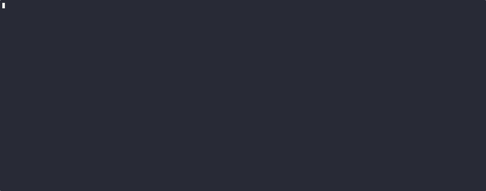
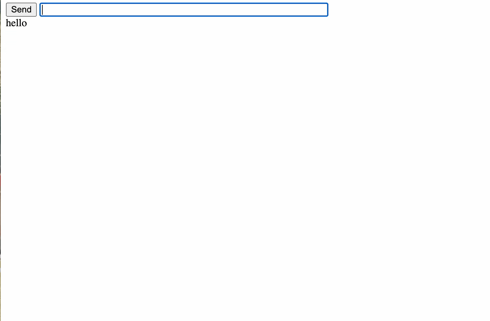
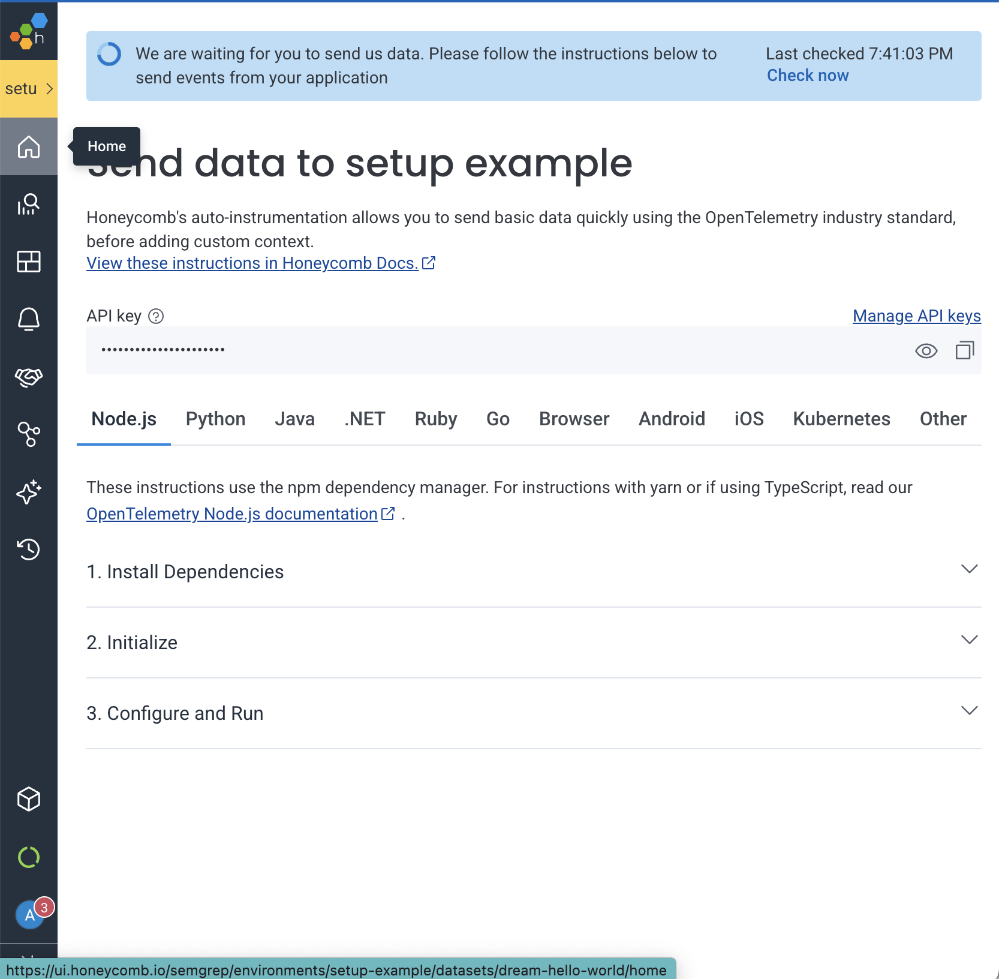

# Observing OCaml with OpenTelemetry
This is a workshop on adding OpenTelemetry to an OCaml program, given at
[FUNOCaml
2025](https://fun-ocaml.com/2025/ocaml-observability-with-opentelemetry/). For
the slides please see [here](https://link.excalidraw.com/p/readonly/6dHJsAEg8pYNdhI1xPk8).

The head of the main branch of this repo is a completed implementation. If you
are following along with the workshop please first checkout the `base` branch:

``` bash
git checkout base
```


### Application Description
The application we will be adding observability to is a simple webserver that
has a simple chat page, a greeting page, a page to run a long computation, and
finally a page that raises an error. It uses [Dream](https://github.com/aantron/dream) as the webserver, and [Dream
HTML](https://github.com/yawaramin/dream-html) to generate HTML templates.
* Entrypoint: [./bin/main.ml](./bin/main.ml) serves up the website
* Index: [./lib/Index.ml](./lib/Index.ml) generates the html for the index page
* Greet: [./lib/Greet.ml](./lib/Greet.ml) displays a greeting to the current user
* Computation [./lib/Computation.ml](./lib/Computation.ml) runs a computation for a random amount of time and reports how long it took
* Error: [./lib/Error.ml](./lib/Error.ml) is not implemented and raises an error


## Part 1: Dev Environment Setup
Let's get your development environment setup so we all can run the same OCaml code.

First make sure you have [opam > 2.2 installed](https://opam.ocaml.org/doc/Install.html), then run
``` bash
make setup
eval $(opam env)
```
Or if you have nix installed:
``` bash
make shell
```
From here you should be able to do:
``` bash
make run
```
and see the following:

then go to [http://localhost:8080](http://localhost:8080) to see the demo application running:


Take a few minutes and play around on the website, look at the code, and think: where might we want to add observability?


## Part 2: Setup OpenTelemetry
Now we need to get OpenTelmetry running. The OCaml OpenTelmetry library has
multiple backends, based on curl, eio or LWT. We will be using the curl library
as it's the simplest to work with. These backends run in separate threads and
will batch signals, and send them to wherever we want our telemetry to end up.

We will be using Honeycomb as it is free and easy to use. First go [sign
up](https://ui.honeycomb.io/signup) for a free account, make an environment
called whatever you want your service to be named, and then copy the api token:



Now set an env var with it: 

``` bash
export HONEYCOMB_TEAM="<api_token>"
```


Now let's write a setup function in [./lib/Observability.ml](./lib/Observability.ml)

``` ocaml
module Otel = Opentelemetry
module Trace = Otel.Trace

let url = "https://api.honeycomb.io/"
let service_name = "dream-hello-world"

let headers =
  (* Get your api token from the env *)
  let team_opt = Sys.getenv_opt "HONEYCOMB_TEAM" in
  match team_opt with
  | None -> failwith "HONEYCOMB_TEAM environment variable not set"
  | Some team ->
      (* alt: just paste it in your code, but don't commit it! **)
      [ ("x-honeycomb-team", team); ("x-honeycomb-dataset", service_name) ]

let setup () =
    (* Sets the service name *)
    Otel.Globals.service_name := service_name;
    (* Point the backend to the honeycomb api and add headers for auth *)
    let config = Opentelemetry_client_ocurl.Config.make ~headers ~url () in
    Opentelemetry_client_ocurl.with_setup ~config ()
```

Now let's wrap the server in [main.ml](./bin/main.ml) in this:

``` ocaml
let () = 
  Observability.setup () @@ fun _ ->
  Dream.run
  @@ Dream.pipeline
       [ Dream.logger; Dream.livereload; Dream.memory_sessions; ]
  @@ Dream.router
       [
         get "/" (fun _request -> Dream_html.respond Index.html);
         get "/chat" (fun _request -> Dream_html.respond Chat.html);
         get "/websocket" (fun _request -> Dream.websocket Chat.handle_client);
         get "/greet" (fun request -> Dream_html.respond (Greet.html request));
         get "/error" (fun _request -> Dream.html (Error.html ()));
         get "/long" (fun _request -> Dream.html Computation.(html ()));
       ]
```


By wrapping the entire server in this setup function we are ensuring that when the server exits, via ctrl c or because of an uncaught exception, we will gracefully shut down the OpenTelemetry backend and ensure all signals flush and get collected.

As part of this setup, this will start sending metrics about your garbage collector. Go to the "Explore Data" page and you should be able to see some things coming in.

## Part 3: Tracing
Let's modify our get alias in [main.ml](./bin/main.ml) to trace the resource:
``` ocaml
module Otel = Opentelemetry
module Trace = Otel.Trace

let get path handler =
  (* Let's name the span based on the path and operation *)
  let name = "GET " ^ path in
  let handler x = Trace.with_ name (fun _scope -> handler x) in
  Dream.get path handler
```

Now if we rerun and go back to our website and click around we should see more
things on the trace page!

We can add "middleware" to Dream, to also trace every request. We can then add
attributes specific to the request to help us query the data.

In [./lib/OMiddleware](./lib/OMiddleware.ml)

``` ocaml
module Otel = Opentelemetry
module Trace = Otel.Trace

let request_attributes (r : Dream.request) =
  let method_ = r |> Dream.method_ |> Dream.method_to_string in
  let session_id = Dream.session_id r in
  let session_label = Dream.session_label r in
  let session_attrs =
    let session_fields = Dream.all_session_fields r in
    List.map
      (fun (k, v) -> ("http.request.session." ^ k, `String v))
      session_fields
  in
  let header_attrs =
    let headers = Dream.all_headers r in
    List.map (fun (k, v) -> ("http.request.header." ^ k, `String v)) headers
  in
  (* Attributes are just key value pairs *)
  [
    ("http.request.method", `String method_);
    ("http.session.label", `String session_label);
    ("http.session.id", `String session_id);
  ]
  @ session_attrs @ header_attrs

let with_middleware (f : Dream.middleware -> 'a) =
  (* Setup observability *)
  Observability.setup () @@ fun _scope ->
  (* Create middleware *)
  let middleware (inner_handler : Dream.handler) request =
    let attrs = request_attributes request in
    (* Setup a top level span that indicates this is the entrypoint of the
       server *)
    Trace.with_ "http.request" ~kind:Opentelemetry_proto.Trace.Span_kind_server
      ~attrs (fun scope ->
        (* Try processing the request *)
        try%lwt inner_handler request
        with exn ->
          (* If there's an exception, record it *)
          let raw_backtrace = Printexc.get_raw_backtrace () in
          Otel.Scope.record_exception scope exn raw_backtrace;
          raise exn)
  in
  f middleware
```

Then let's replace the wrapper around the server with this middleware in [main.ml](./bin/main.ml)

``` ocaml
let () = 
  OMiddleware.with_middleware @@ fun observability ->
  Dream.run
  @@ Dream.pipeline
       [ Dream.logger; Dream.livereload; Dream.memory_sessions; observability ]
  (* ... *)
```

Now we have tracing fully setup! Try clicking around the website, specifically
the error page. You should see in Honeycomb we now have error tracking, which we
can find in traces and the home page. You can also see how spans nest. Try
tracing more functions, such as the long computation function

### Part 4: Logging

You may have noticed that Dream has its own logger. This logger utilizes the
Logs library, meaning we can use the OpenTelmetry Logs library integration in
order to automatically collect all the logs.

First we need to make sure that Dream's logging is setup. Once it is, we can
attach a logger that will collect all logs.

In [OMiddleware.ml](./lib/OMiddleware.ml) initialize Dream's logging:
``` ocaml
(* ... *)
let with_middleware (f : Dream.middleware -> 'a) =
  (* Initialize the dream logger so in setup we can attach to it *)
  Dream.initialize_log ();
  (* ... *)
```

then in [Observability.ml](./lib/Observability.ml) attach the logger:

``` ocaml
(* ... *)
let setup_logger () =
  (* Get the Dream logger *)
  let current_reporter = Logs.reporter () in
  (* Now attach our logger *)
  let reporter = Opentelemetry_logs.attach_otel_reporter current_reporter in
  (* Now set this as the global logger *)
  Logs.set_reporter reporter

let setup () =
  Otel.Globals.service_name := service_name;
  setup_logger ();
  (* ... *)
```

Now run the server, click around etc. You should see nice logs rolling in on the
Honeycomb logs page. Additionally, if you look at a trace, you can see when the
log happened, and in what context!

### Part 5: Metrics
Finally, let's add some metrics! What's interesting is we already have some,
since the OCaml OpenTelemetry library automatically sets up metrics for the
garbage collector, but let's add some more.

In [./lib/Metrics.ml](./lib/Metrics.ml) let's add two metrics. One to count how
many requests we've received, and one to count how many messages we've sent.
Note that we could count the former by counting how many `http.request` spans
there are, but let's add this metric so we can double check.

``` ocaml
open Opentelemetry
open Metrics

let now = Timestamp_ns.now_unix_ns
let send_metrics = Metrics.emit

let count_request () =
  (* Our metric type here is sum, as opposed to a guage or histogram, since what
     we are measuring can be added together, where as a guage is for metrics you
     can't "add", such as the size of the major heap, and a histogram is for
     recording a distribution of a population *)
  [
    sum
      ~name:"server.requests.total"
        (* Aggregation temporality is if we are sending the /change/ in the
         metric (delta) or the final value (cumulative) *)
      ~aggregation_temporality:Metrics.Aggregation_temporality_delta
        (* monotonic means the sum is always increasing *)
      ~is_monotonic:true
      [ int ~now:(now ()) 1 ];
  ]
  |> send_metrics

let message_sent () =
  [
    sum ~name:"chat.messages.sent"
      ~aggregation_temporality:Metrics.Aggregation_temporality_delta
      ~is_monotonic:true
      [ int ~now:(now ()) 1 ];
  ]
  |> send_metrics
```

Then we can add the first metric to our middleware in
[OMiddleware.ml](./lib/OMiddleware.ml):

``` ocaml

(* ... *)
let with_middleware (f : Dream.middleware -> 'a) =
  (* ... *)
  let middleware (inner_handler : Dream.handler) request =
    Metrics.count_request ();
    (* ... *)
```

and the second to our chat code in [Chat.ml](./lib/Chat.ml)

``` ocaml
(* ... *)
let send message =
  Metrics.message_sent ();
  (* ... *)
```

Now if we hit the chat endpoint a bunch, then go to the query page in Honeycomb, we can sum over these metrics to see what they look like.


Now try adding your own metrics, or playing around more with the data in Honeycomb

## Conclusion
We now have an application with observability! Try adding more tracing, logging,
and metrics. Play around in Honeycomb and try making dashboards or alerts.
